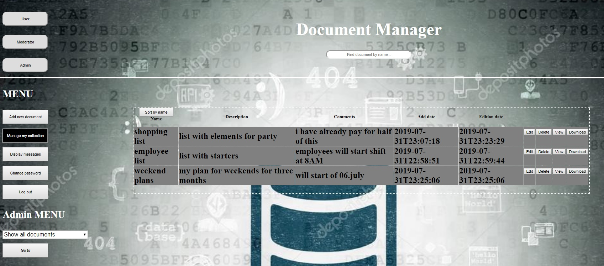
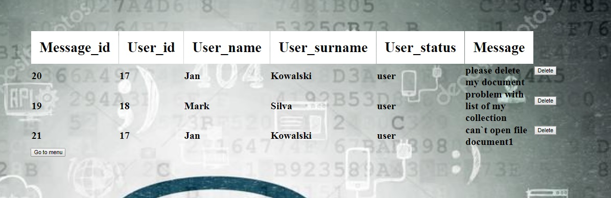

PROJECT NAME
#DocumentManager

DESCRIPTION 
Project used to save and manage files in database.
User can manage his file collection.
Technologies: Java, Spring Boot, MySQL, Junit, Mockito, HTML, CSS.

USAGE
Program will start at localhost:8080 authomaticly with login page.

Two options for user registry or log in.

User pannel is able to change user status and add diffirent options depend of user status.

Users are able to manage own file collection, moderator and admin are able to manage collections of all users.

User and moderator are able to send message to admin

